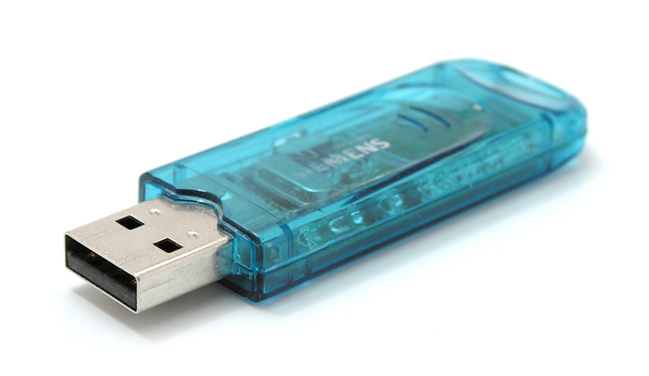

#IDE Setup

##Eclipse V's BlueJ

Elipse is much more complicated than BlueJ but if you stick to the basics it will do the same job as BlueJ, however BlueJ is more suited to people who have never coded before or may find it better because it gives a more visual representation of you projects and its classes. (more on that later)

##Different ways to run BlueJ

You can run BlueJ from you PC/Mac or run it from your USB pen, we will have a look a the BlueJ set from a USB pen first.

 

To run BlueJ from your USB pen drive download [this zip file](https://moodle.wit.ie/draftfile.php/43413/user/draft/799448923/Course_IDE_-_Version_3.0.2.zip) to your pen Drive and un-zip the file, you will now have two new folders called BlueJ and JDK1.6_0.7

- In the BlueJ folder you can run the BlueJ.exe program (**Note: ** you can create a shortcur to this exe)
- Choose the Advanced Option
- Click "Browse for a specific java version"
- Navigate to the **JDK1.6_0.7** folder then the **bin** folder and select the java.exe program (this is the JDK)
- BlueJ should open now and your ready to start writing Java Programs

 

 You can take the same steps above to download and Install BlueJ to your PC/Mac

##Eclipse

Its better if you have the latest version of Eclipse (Luna when writing this) you can download it from [here](https://www.eclipse.org/downloads/packages/)

Installation is straight forward, just download the latest version of the IDE for java Developers for your platform i.e. Mac or windows and then open the download and take the default options to proceed with the install

