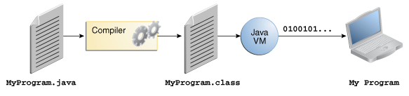

#BlueJ Basics

You should have BlueJ installed now, but just in case you done have a look [here](http://www.bluej.org/download/install.html) for some install instructions. If you still have problems have look [here](http://www.bluej.org/faq.html)

##The Complile process

When we write and run programs in java we must go through the [compile progrss.](http://www.oracle.com/technetwork/java/compile-136656.html) When we write java program (lets say the HellowWorld.java) we create a file with the .java extension, through our IDE we complie this program but behind the scences the JDK will create another file called a class file which contains bytecode, we then run this bytecode through the Java Virtual Machine (the Java VM) which gives us out output or result, see image below.

 
 
 ##The BlueJ Window
 
 When you open blueJ for the forst time you will sse the BlueJ Project window, this is where you can create projects, classes and write code in each class then compile these classes.
 
  

 ##Start Writing `Code`

 Its best to just dive in a start writng code, we will use the old classic HelloWorld Program to demoenstrate this.

- create a new folder and call it bluej_workspace, this will be used to store all you BlueJ projects, this could be on your USB, dropbox or hard drive.
- Before you create the HellowWorld Project have a look in the bluej_worspace folder, notice the way you dont see the HellowWorld Project
- Launch BlueJ and create a new project called HelloWorld

- Now look in the bluej_workspace folder, this time you will see the new HelloWork Project, this project will contain all the details that you about to create. i.e. the HelloWorld.java file etc.

- Now we need to create a new class, click on the New Class Button within the BlueJ window (top Left)

