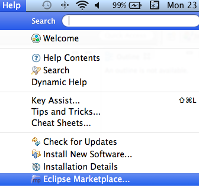
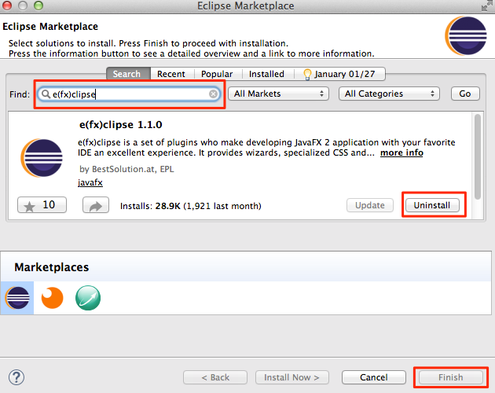

#Getting Started  . . . cntd

You now have eclipse installed, you are pointing eclipse to the latest version of the JDK and you also have Scene Builder installed, now there's just one last step and that is to install e(FX)clipse

##e(FX)clipse setup 

e(FX)clipse is a plugin for eclipse that allows you to create JavaFX Applications

##The Easy Install

- if you want you can download what you need from [here](http://efxclipse.bestsolution.at/install.html#all-in-one)

##The Easier Install

- Open eclipse
- Click in _Help_ - _Eclipse Marketplace_

- Enter _e(fx)clipse_ in the search box and hit enter, you will see **e(fx)clipse Version Number**, click _Install_ the _Finish_

- thats it ! - your ready now to write code :)