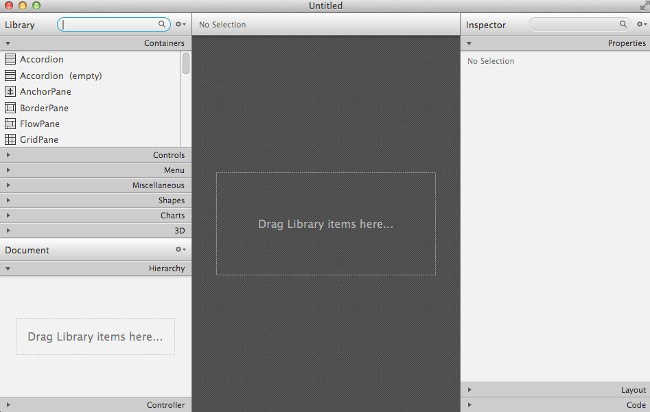

#Exercises

##Solution

This is an archive (zip file) of a solution to the lab so far:

- [archive.zip](./archives/archive.zip)

##Exercise 1

Open Eclipse and great a new JavaFX project - _New, Project, JavaFX, JavaFX Project_ - call it _FirstSample_ when your finished doing that you should have Java code in the main class (main.java) like the following:

~~~java
package application;
	
import javafx.application.Application;
import javafx.stage.Stage;
import javafx.scene.Scene;
import javafx.scene.layout.BorderPane;

public class Main extends Application {
	@Override
	public void start(Stage primaryStage) {
		try {
			BorderPane root = new BorderPane();
			Scene scene = new Scene(root,400,400);
			scene.getStylesheets().add(getClass().getResource("application.css").toExternalForm());
			primaryStage.setScene(scene);
			primaryStage.show();
		} catch(Exception e) {
			e.printStackTrace();
		}
	}
	
	public static void main(String[] args) {
		launch(args);
	}
}
~~~

##Exercise 2

Open Scene Builder and experiment with some of the [Containers](https://docs.oracle.com/javafx/scenebuilder/1/user_guide/library-panel.htm) 

You should see something like;

