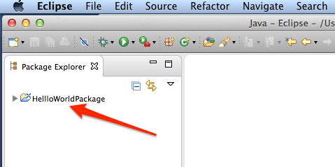
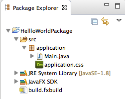

##Hello World

A ["Hello, world!"](http://www.thehelloworldprogram.com/) program has become the traditional first program that many people learn. In general, it is simple enough so that people who have no experience with computer programming can easily understand it, especially with the guidance of a teacher or a written guide.

##Create the Application

Open Eclipse and great a new JavaFX project - _New, Project, JavaFX, JavaFX Project_ - call it _HelloWorldPackage_ 

followed by 

If you look in the package Exploer to the left you will see you new packake called _HelloWorldPackage_

In that package you will the following structure:

1. **src** (Source Folder)
2. **application** (this is where you programmes will be stored)
3. the actual programms which will include **main.java** and **application.css**

When your finished doing that you should open the main class (main.java) and you should have code like the following:

~~~java
package application;
	
import javafx.application.Application;
import javafx.stage.Stage;
import javafx.scene.Scene;
import javafx.scene.layout.BorderPane;

public class Main extends Application {
	@Override
	public void start(Stage primaryStage) {
		try {
			BorderPane root = new BorderPane();
			Scene scene = new Scene(root,400,400);
			scene.getStylesheets().add(getClass().getResource("application.css").toExternalForm());
			primaryStage.setScene(scene);
			primaryStage.show();
		} catch(Exception e) {
			e.printStackTrace();
		}
	}
	
	public static void main(String[] args) {
		launch(args);
	}
}
~~~

If you **Run** the program you should see a blank window

