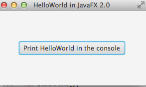

HelloWorld .. cntd

In you HelloworldPackage rename the __main.java__ and open the program

If you remember we ran our program and just got a blank window. We will need to change some code in order to finish our program so that we can click a button and our program will display a message to the console.

##The Anotomy of the Application

- To start your application you have to call (run) the static method __launch__ as seen in the main method. After launching your application, it will call the __start__ method. 

- The entry point for JavaFX applications is the Application class. The JavaFX runtime does the following, in order, whenever an application is launched: Constructs an instance of the specified Application class

    1. Calls the init() method
    2. Calls the start(javafx.stage.Stage) method
    3. Waits for the application to finish, which happens either when the last window has been closed, or the application calls Platform.exit()
    4. Calls the stop() method

##Start with these changes

Below this link of code

~~~java
package application;
~~~

##Import some extra packages 

The [JavafX API](http://docs.oracle.com/javase/8/javafx/api/toc.htm) allows us eto use code that sun-micro systems have already pre-written for you.

- It's important that you understand the API below you will see the new codde that you need to place in your HelloWorld. java program
- For example __javafx.scene.control__ is a package and __Button__ is a class that resides inside the  __javafx.scene.control__ class

Place this code just below your __package application;__

~~~java
import javafx.application.Application;
import javafx.event.ActionEvent;
import javafx.event.EventHandler;
import javafx.scene.Scene;
import javafx.scene.control.Button;
import javafx.scene.layout.StackPane;
import javafx.stage.Stage;
~~~

##Delete some code

Delete the following code

~~~Java
    try {
      BorderPane root = new BorderPane();
      Scene scene = new Scene(root,400,400);
      scene.getStylesheets().add(getClass().getResource("application.css").toExternalForm());
      primaryStage.setScene(scene);
      primaryStage.show();
    } catch(Exception e) {
      e.printStackTrace();
    }
~~~

##Add in the following code

Let´s start with the source code inside the __start__ method.

First of all we create a simple Button and specify an action to be triggered when the button is clicked via the setOnAction method (compare JButton´s addActionListener).

~~~java
        Button bt = new Button("Print HelloWorld in the console");
        bt.setOnAction(new EventHandler<ActionEvent>() 
        {
            @Override
            public void handle(ActionEvent arg0)
            {
                System.out.println("HelloWorld! :)");
            }
        });
~~~

Next we create a StackPane object, which is one of the layout panes in JavaFX. We use a StackPane here, because it automatically takes all the available space provided by its surrounding parent and because it automatically centers it's children inside, the button above.

~~~java
        StackPane root = new StackPane();
        Scene scene = new Scene(root, 300, 150);
        root.getChildren().add(bt);
        
~~~

**Note:** The foundation of a JavaFX application is the Scene graph. Every single Node (which includes simple controls, groups and layout panes) is part of a hierarchical tree of nodes, which is called the Scene graph. The Scene graph and therefore your whole JavaFX application has always **one single** root node!

As mentioned above, the start method has a Stage object parameter, which is provided by the JavaFX runtime. This Stage object is a kind of window. You have to give it a Scene object as its viewable content. You can create a Scene object by passing the root node of your application. Optional parameters are the width and the height of your scene as well as a Paint object, which includes simple colors and also complex color gradients.

With root.getChildren().add(bt); you add the button to your root node, which is a stackpane.
After that we set a title to the stage and apply the created scene object. Finally with the show method we tell the stage to show.

~~~java
        stage.setTitle("HelloWorld in JavaFX 2.0");
        stage.setScene(scene);
        stage.show();
~~~

If you have added the code above and run it you should see the following screen

Full source is available [here](https://github.com/coneill040/java-javafx/blob/master/topic02/book/HelloWorld.java)

